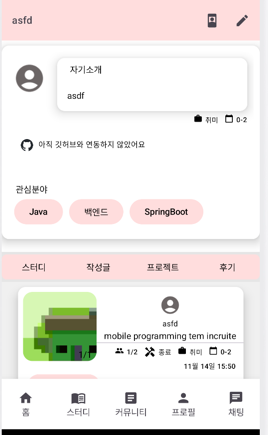
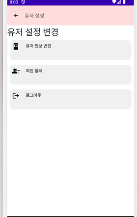
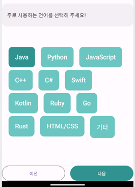
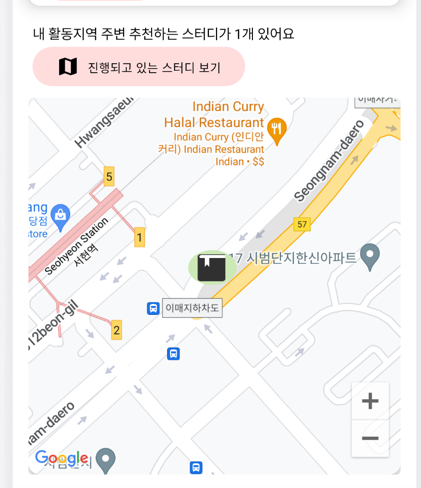
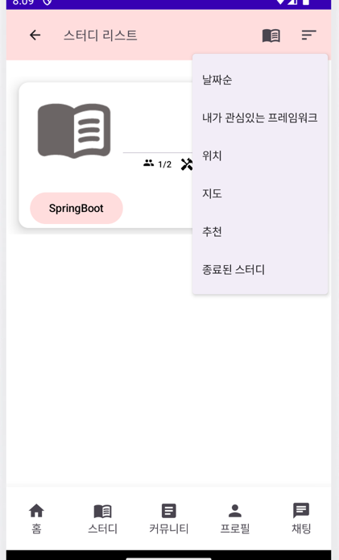
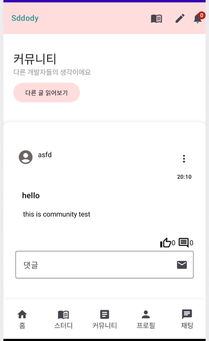
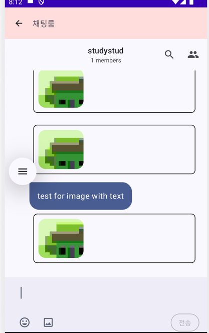

# Sddody: 개발자 팀 프로젝트 매칭 애플리케이션

## Sddody 서버 깃허브 링크
https://github.com/PraiseBak/CloudeSddodyServer/tree/main/Sddody%20copy

## 프로그램 설치 URL
https://drive.google.com/file/d/1ZtA2qCMGVJF9mF-g310INqz_3IjEPkIn/view

## 📱 App Description
개발자들을 위해 기존의 번거로웠던 **프로젝트 팀 빌딩** 과정을 간소화하고   
성공적인 프로젝트 진행을 돕는 것을 목표로 만들어진 개발 팀 프로젝트 매칭 애플리케이션 Sddody입니다.
프로젝트 생성부터 관리,사용자와 적합한 프로젝트 추천,   
위치 기반한 프로젝트 추천 등 여러 편의성 기능과   
개발자들간의 역량 파악을 위한 포트폴리오 작성 및 깃허브 연동 등 여러 역량 파악까지 다양한 기능을 제공합니다.

## 🔍 주요 기능 및 사용방법

### 사용자 프로필 시스템

- 개인의 기술 스택과 프로젝트 경험을 선택할 수 있습니다. 
  - **프로필 생성** 및 **기술 스택 등록**
  - **포트폴리오 작성** 및 **업데이트**
  - **프로필 정보 수정**
  - 계정 탈퇴 및 로그아웃   
  
   
아래 하단바에서 프로필을 선택한 화면입니다.       
프로필화면에서 유저의 관심분야, 작성글, 깃허브 요약등을 확인할 수 있습니다.    

상단 첫번째 버튼을 눌러 유저 설정을 할 수 있습니다.   

   
해당 설정화면에서는 계정 탈퇴 및 로그아웃을 할 수 있습니다.   
유저 정보 변경을 눌러 스택 등을 변경할 수도 있습니다.   
   

### 프로젝트 관리 및 추천
- 사용자의 기술 스택과 위치 정보를 바탕으로 맞춤형 프로젝트를 추천합니다.
    - **기술 스택 기반 프로젝트 탐색**
    - **위치 기반 프로젝트 매칭**
    - **조건별 필터링**을 통한 프로젝트 찾기
- 프로젝트의 상제 정보 확인 및 참여 기능
    - 프로젝트 상세 정보 확인 및 참여 신청
    - 프로젝트 일정 관리 및 후기도 작성 가능   

   
[메인페이지에서 위치 기반으로 프로젝트를 추천해주는 화면입니다]

아래의 하단바에서 스터디 -> 설정버튼을 눌러 조건별 필터로 프로젝트를 찾을수도 있습니다

### 커뮤니티 기능
- 개발자들 간 자유로운 소통을 위한 커뮤니티 기능을 제공합니다.

### 채팅 기능
- 프로젝트 단위의 실시간 소통을 위한 채팅 기능입니다.
    - 팀 내 실시간 채팅
    - 알림 기능
    - 이미지 및 콘텐츠 업로드   

이미지와 함께 메시지를 전송하는 모습입니다.
### 유저 검증 시스템
- IP 기반의 검증 시스템으로 권한이 없는데 지속적으로 요청하는 등
악성 사용자를 차단하여 안전한 사용자 환경을 제공합니다.(서버 기능)

## 📽️ 데모 영상
> [애플리케이션 데모 영상](https://youtu.be/927gnLpcZ28)

## 🧑‍💻 팀 소개
- **박찬양**: 창원대학교 컴퓨터공학과 4학년 재학 중, 전체적인 애플리케이션 개발 및 설계 담당
- **김민준**: 창원대학교 컴퓨터공학과 2학년 재학 중, 문서 작성, UI 디자인 및 일정 관리 기능 개발

## 💻 개발 환경 및 아키텍처
- **채팅 브로드캐스트**: Firebase
- **데이터베이스**: MySQL
- **이미지 서버**: AWS S3
- **배포 및 자동화**: Docker, GitHub CI/CD
- **백엔드 서버**: AWS EC2 + Spring Boot   

---

## 🔜 향후 계획
- **사용자 편의성 개선**
- **디자인 개선**
- **추가 기능 구상**: 팀 빌딩, 프로젝트 관리 기능의 확장과 개선
